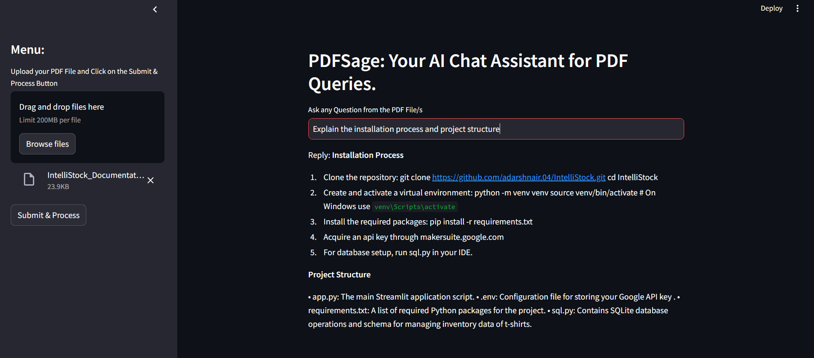

# PDFSage

PDFSage is an intuitive tool that allows users to interact with PDF documents through a chat interface. By asking questions directly, users receive accurate, context-driven answers derived from the PDF content, making complex information easily accessible and understandable.



## Features
- Extracts and processes text from PDF files.
- Splits the text into manageable chunks.
- Stores and retrieves text chunks using FAISS (Facebook AI Similarity Search).
- Leverages Google Generative AI models to provide detailed, context-aware responses.
- Presents query results in a clear and understandable text format.

## Installation

### Clone the repository:
```sh
git clone https://github.com/yourusername/PDFSage.git
cd PDFSage
```

### Create and activate a virtual environment:
```sh
python -m venv venv
source venv/bin/activate  # On Windows use `venv\Scripts\activate`
```

### Install the required packages:
```sh
pip install -r requirements.txt
```

### Acquire an API key through makersuite.google.com

## Usage

### Set up environment variables by creating a `.env` file and adding your Google API key:
```sh
GOOGLE_API_KEY=your_google_api_key
```

### Run the Streamlit application:
```sh
streamlit run app.py
```

The web app will open in your browser where you can ask questions.

## Code Explanation

- **get_pdf_text(pdf_docs):** Function to extract text from PDF files.
- **get_text_chunks(text):** Function to split the extracted text into manageable chunks.
- **get_vector_store(text_chunks):** Function to store and retrieve text chunks using FAISS.
- **get_conversational_chain():** Function to set up the conversational AI model.
- **user_input(user_question):** Function to process user input and display results.
- **Streamlit app setup:** Main script to get user input and display results in a chat interface.

## Sample Questions

- What is the main topic of this section?
- Can you summarize the first chapter?
- What are the key points mentioned in the document?
- Explain the methodology used in the study.
- What are the conclusions drawn in the last section?

## Project Structure

- **app.py:** The main Streamlit application script.
- **.env:** Configuration file for storing your Google API key.
- **requirements.txt:** A list of required Python packages for the project.
- **LICENSE:** The license file for the project.

## License

This project is licensed under the MIT License - see the [LICENSE](LICENSE) file for details.
